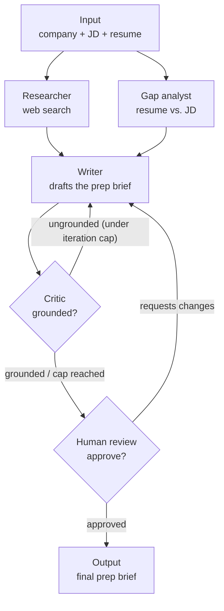

# career-recon

[](https://github.com/sameswar001/career-recon/actions/workflows/ci.yml)
[](LICENSE)
[](https://www.python.org/)
[](https://github.com/astral-sh/uv)

Multi-agent system built with LangGraph. Given a target company and a job
posting, it researches the company, diffs the posting against a resume for
real gaps, and drafts an interview-prep brief — with a grounding critic that
rejects unsupported claims and loops the draft back for revision, and a
human-approval checkpoint before anything is finalized.

The domain is deliberately outside QA and legal: it's a general agent-orchestration
problem (parallel tools, self-critique loops, human-in-the-loop persistence), built
to show AI-engineering range beyond evaluation work.

## Architecture



State (`state.py`) is a shared `TypedDict` carrying `company`, `job_posting`,
`resume`, `research_notes` (source-tracked), `gaps`, `draft`, `critique`, and
`iteration_count` through every node.

## Why LangGraph

A linear researcher -> writer chain wouldn't need a graph framework at all —
you could write it in a few lines with no orchestration library. Three things
here specifically need what LangGraph provides:

- **Cycles.** The critic checks the draft against the research notes and, on an
  ungrounded claim, routes back to the writer with structured feedback — a real
  loop, capped at a max iteration count so it can't spin forever. See the
  [sample run](docs/sample-run.md) for the loop catching a fabricated valuation.
- **Fan-out / fan-in.** The researcher (web search) and gap-analyst (resume vs.
  JD) have no dependency on each other, so they run as parallel branches and
  join at the writer.
- **Interrupt + persistence.** Human review is a real `interrupt()` backed by a
  SQLite checkpointer — the graph suspends, and a run can be resumed in a
  separate process with the same `--thread-id`, not restarted.

The grounding critic applies the same evaluation discipline as a RAG-eval suite
— every claim must trace to a source — to an agent's own output rather than a
retrieval pipeline's.

## Project layout

```
state.py          shared graph state (TypedDict threaded through every node)
core/llm.py       provider factory — ollama | anthropic | openai, via env var
entrypoint/cli.py start / resume entrypoint, SqliteSaver persistence
graph/graph.py    wires the nodes into the StateGraph
nodes/            researcher, gap_analyst, writer, critic, human_review
tools/            web_search (Tavily)
tests/            per-node unit tests (mocked) + one gated live e2e run
docs/             sample run walkthrough
.github/workflows CI: ruff + mocked unit tests on every push
```

## Usage

```bash
python entrypoint/cli.py start --company "Acme Corp" --job-posting jd.txt --resume resume.txt
```

Pauses for your approval when the draft is ready. If you exit before
approving, the run is checkpointed in career_recon.db — pick it back up
without repeating the research or writing:

```bash
python entrypoint/cli.py resume --thread-id <the-thread-id-printed-at-start>
```

## Testing

```bash
uv run pytest
```

Unit tests cover every node (`researcher`, `gap_analyst`, `writer`, `critic`,
`human_review`) plus the CLI's start/resume loop, with the LLM and Tavily mocked,
so they run in CI with no API keys. `tests/test_graph_skeleton.py` is a live
end-to-end run through the real graph and skips itself unless `TAVILY_API_KEY` is set.

## Setup

```bash
uv sync
```

Environment variables:

| Variable | Required | Default | Purpose |
|---|---|---|---|
| `TAVILY_API_KEY` | Yes | — | Web search for the researcher node |
| `LLM_PROVIDER` | No | `ollama` | `ollama` \| `anthropic` \| `openai` |
| `LLM_MODEL` | No | provider default | Overrides the default model for the chosen provider |
| `ANTHROPIC_API_KEY` / `OPENAI_API_KEY` | Only if using that provider | — | Cloud provider auth |

Ollama (the default) needs a local server running (`ollama serve`) with the
model pulled (`ollama pull llama3.2:latest`).
